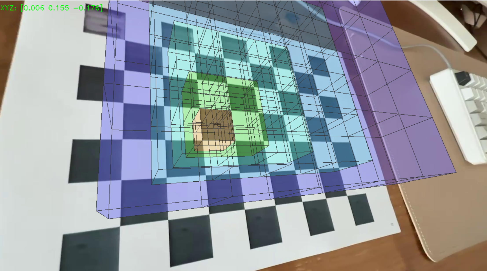

# my_Camera_Pose_Estimation_and_AR
my_Camera_Pose_Estimation_and_AR using OpenCV

## Reference (Camera pose estimation)
[my_camera_calibration](https://github.com/Oxalidaceae/my_camera_calibration)
* RMS error = 1.2178005946152135
* Camera matrix (K) =
```
[[590.46512818   0.         641.58986121]
 [  0.         590.38915726 365.10676819]
 [  0.           0.           1.        ]]
```
* Distortion coefficient (k1, k2, p1, p2, k3, ...) = [ 0.00304039 -0.00735964  0.00019495  0.00068062  0.00116275]

## Overview
**🧱 Minecraft-style AR Pyramid in OpenCV**

This project renders a **3D Minecraft-style pyramid** using **augmented reality (AR)** techniques.  
It detects a physical chessboard in a video feed and **draws a semi-transparent pyramid built from block-like cubes** on top of it, like in Minecraft.




## 🎥 Features

- ✅ AR pyramid rendering on a chessboard using pre-fitted camera calibration
- ✅ 3D pyramid built from stacked block-like cubes
- ✅ Each layer has a unique color for visual depth
- ✅ Blocks are **semi-transparent** with visible grid lines (Minecraft-like style)
- ✅ Saves the AR-rendered result to `output_pyramid_ar.mp4`


> ⚠️ Note: This program is valid **only for videos/environments calibrated with the provided camera parameters**.
  The intrinsic matrix (`K`) and distortion coefficients (`dist_coeff`) must match the input video setup.

  ## Output video
  

  ## Reference
  [MINT Lab](https://github.com/mint-lab/3dv_tutorial)
